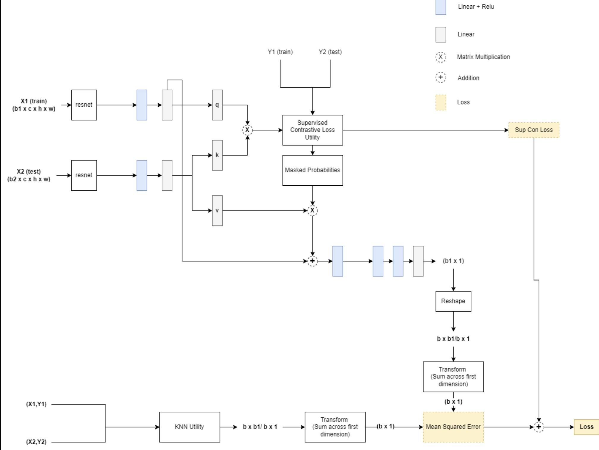

# fw-shapley
Fast Weighted shapley: Real time estimation of weighted shapley values


## Architecture
Architecture diagram for data valuation setting 
- We have leverage Supervised Contrative Loss from this paper: https://arxiv.org/pdf/2004.11362.pdf



## Files
- ```src/networks/model.py```: stores the architecture of the weighted shapley estimator network
- ```src/networks/losses.py```: Computes Supervised Contrastive loss 
- ```src/utils.py```: stores classes to compute utility (using KNN surrogate)
- ```src/train.py```: *ParameterizedShapleyEstimator* class (adaptation of FastSHAP class)
- ```src/extract_features.py``` - reduces the dimensionality of image datasets to 32 (features from ResNet18, then PCA). (features stored in ```/features/``` folder)

## Experiments
- All the experimnets are present in experiments folder
